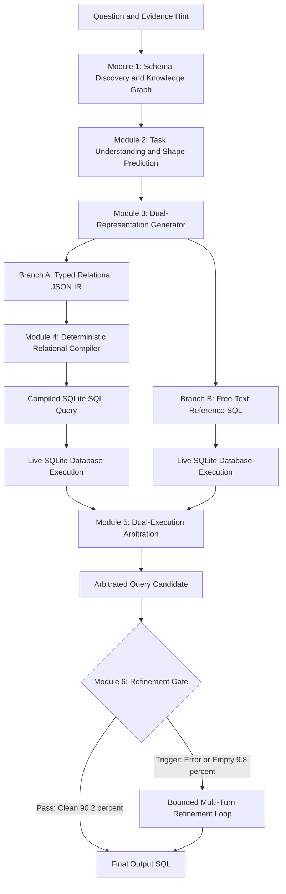
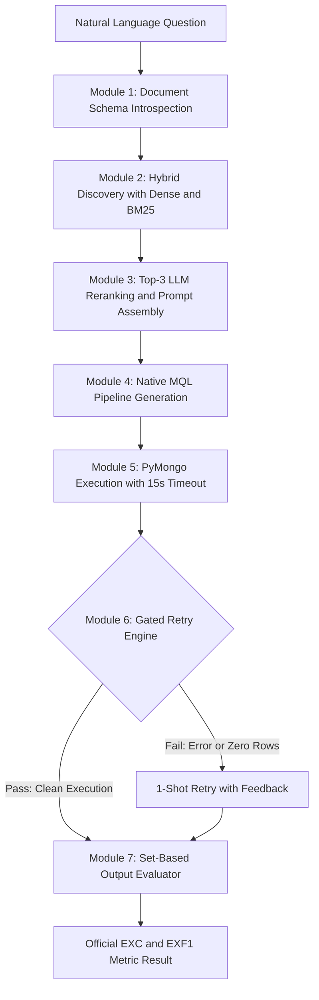

# Cross-Database Benchmark Engine: System Architecture

The CrossDB benchmark engine evaluates natural language to database query generation across two distinct database paradigms:
1. **Relational Databases**: SQLite backend evaluated on the BIRD benchmark.
2. **Document Databases**: MongoDB backend evaluated on the TEND benchmark.

---

## 1. Relational Architecture (SQLite / BIRD)

### 1.1 Relational Architecture Diagram



---

### 1.2 Relational Module Breakdown

#### Module 1: Schema Discovery and Knowledge Graph
* **Purpose**: Select the correct tables from the database catalog and discard unrelated tables.
* **Input**: User question text, database identifier, and evidence string.
* **Operation**:
  1. **Candidate Universe**: Loads the 75 target BIRD collections. When distractor schemas exist, the `--bird-only-discovery` filter removes them.
  2. **Dense Semantic Retrieval**: Computes cosine similarity between question embeddings and table description embeddings using `sentence-transformers/all-MiniLM-L6-v2`.
  3. **Knowledge Graph Boost**: Queries the `FieldLevelKnowledgeGraph` (588 typed edges). The graph identifies foreign keys (`FK_REFERENCE`), identical column names (`SHARED_KEY`), and name patterns (`NAME_PATTERN`). Case and whitespace normalization (`_normalize_col_key`) connects identical keys with different naming styles (for example, `"Customer ID"` and `"CustomerID"`).
  4. **Property Match Reranking**: Calculates token overlap between the question and table column names with a weight factor of 0.15.
  5. **Value Catalog Boost**: Matches literals in the question against indexed column value statistics.
* **Output**: Ranked candidate table list and foreign-key join paths.

#### Module 2: Task Understanding and Shape Prediction
* **Purpose**: Extract literals and predict output structure before query generation.
* **Input**: Question text, evidence hint, and candidate table schemas.
* **Operation**:
  1. Executes 1 dedicated model call.
  2. Extracts database literals and named entities.
  3. Predicts the structural answer shape: `expected_row_count`, `expected_column_count`, `expected_answer_type`, and ambiguity notes.
* **Output**: Structured task metadata used by Module 3 and Module 6.

#### Module 3: Dual-Representation Generator
* **Purpose**: Generate 2 independent query representations in 1 model call.
* **Input**: Assembled prompt containing table schemas, foreign-key catalog, sample rows, on-demand column descriptions (`--t1-w3b-cheat-tool`), and Task Understanding output.
* **Operation**:
  1. Generates output at temperature 0.1 with thinking tokens suppressed (`LM_DISABLE_THINKING=1`).
  2. **Representation A (Structured IR)**: Emits a validated JSON object conforming to `RelationalQueryArgs`:
     * `collection_name`: Primary table.
     * `additional_collections`: Secondary tables, each assigned a functional role.
     * `join_keys`: Explicit pairs of `left_property` and `right_property`.
     * `select`: Array of output targets, each tagged with kind (`raw_column`, `aggregation`, `expression`, `date_function`).
     * `filters`: Array of conditions (`property_name`, `operator`, `value`, `case_sensitive`).
     * `order_by`, `limit`, and `distinct` flags.
  3. **Representation B (Reference SQL)**: Emits a raw SQL string described as an alternate phrasing of the query.
* **Output**: Structured JSON IR and free-text Reference SQL string.

#### Module 4: Deterministic Relational Compiler
* **Purpose**: Translate `RelationalQueryArgs` into valid SQLite SQL without model calls.
* **Input**: `RelationalQueryArgs` JSON object.
* **Operation**:
  1. Maps collections to verified SQLite table names and assigns aliases (`T1`, `T2`).
  2. Builds the `SELECT` clause from the typed `select` items. Wraps column names with backticks to escape SQLite keywords (such as `order`, `group`, and `year`).
  3. Injects `CAST(x AS REAL)` on division operators to prevent integer truncation.
  4. Generates the `FROM` and `JOIN` clauses. Resolves join conditions using explicit `join_keys`.
  5. Translates filter operators (`=`, `!=`, `>`, `<`, `LIKE`, `IN`, `BETWEEN`).
  6. Adds `COLLATE NOCASE` to string equality comparisons unless `case_sensitive` is true.
  7. Constructs `GROUP BY`, `HAVING`, `ORDER BY`, and `LIMIT` clauses.
* **Output**: Compiled SQLite SQL string.

#### Module 5: Live Database Execution and Dual-Execution Arbitration
* **Purpose**: Run both queries and arbitrate disagreements without ground-truth access.
* **Input**: Compiled SQL query and Reference SQL query.
* **Operation**:
  1. Executes both queries against the real SQLite database using a 30-second progress handler timeout.
  2. Compares the resulting row sets to each other (multiset equality).
  3. Applies the deterministic arbitration decision matrix:

| Compiled SQL Status | Reference SQL Status | Result Comparison | Action Taken |
|---|---|---|---|
| Fails | Succeeds | Not comparable | Use Reference SQL |
| Succeeds | Fails | Not comparable | Use Compiled SQL |
| Succeeds | Succeeds | Result sets match | Use Compiled SQL |
| Succeeds | Succeeds | Result sets differ | Use Reference SQL (default rule) |
| Fails | Fails | Not comparable | Use Compiled SQL (to trigger refine gate) |

* **Output**: The arbitrated SQL query candidate and execution result rows.

#### Module 6: Execution-Gated Refinement Loop
* **Purpose**: Repair defective queries without corrupting correct queries.
* **Input**: Arbitrated SQL query candidate, execution result, and expected shape.
* **Operation**:
  1. **Gate Evaluation**: Evaluates 4 checkable failure conditions:
     * Runtime database exception (`error is not None`).
     * Zero rows returned (`row_count == 0`).
     * Single suspicious zero (`row_count == 1` and value $\in \{\text{"0"}, \text{"0.0"}, \text{"NULL"}, \text{""}\}$).
     * Column count mismatch against Task Understanding prediction.
  2. **Gate Decision**:
     * If no failure condition triggers (90.2% of queries): Ships the query immediately.
     * If any failure condition triggers (9.8% of queries): Enters the multi-turn repair loop.
  3. **Repair Loop**:
     * Shows the model its own `ExecutionReport` (error message, column headers, and observed rows).
     * Permits read-only diagnostic tools (`describe_column`, `describe_table`, `distinct_values`, `search_values`, `probe_sql`, `join_paths`). Diagnostic calls do not consume the turn budget.
     * The model submits a corrected JSON IR via the `submit` tool.
     * Enforces a 2-round iteration limit (`--refine-max-rounds 2`).
     * Falls back to the initial draft on 2 consecutive invalid submissions or text responses without tool calls.
* **Output**: Final verified SQLite SQL query.

---

### 1.3 Relational Worked Example (BIRD)

#### Question Input
* **Natural Language**: `"How many schools in Fresno County have an average SAT math score higher than 500?"`
* **Evidence**: `"Fresno County refers to County Name = 'Fresno'"`
* **Database**: `california_schools`

#### Step 1: Schema Discovery
* Discovered Tables: `schools` (Primary), `satscores` (Secondary).
* Foreign Key Path: `schools.CDSCode = satscores.cds`.

#### Step 2: Task Understanding
```json
{
  "database_literals": ["Fresno", "500"],
  "expected_row_count": 1,
  "expected_column_count": 1,
  "expected_answer_type": "integer"
}
```

#### Step 3: Model Generation (`RelationalQueryArgs` Output)
```json
{
  "collection_name": "CaliforniaSchoolsSchools",
  "additional_collections": [
    {
      "collection_name": "CaliforniaSchoolsSatscores",
      "role": "provides SAT math test scores for filtering"
    }
  ],
  "join_keys": [
    {
      "left_collection": "CaliforniaSchoolsSchools",
      "left_property": "CDSCode",
      "right_collection": "CaliforniaSchoolsSatscores",
      "right_property": "cds"
    }
  ],
  "select": [
    {
      "kind": "aggregation",
      "property": "CDSCode",
      "function": "COUNT",
      "distinct": true
    }
  ],
  "filters": [
    {
      "collection": "CaliforniaSchoolsSchools",
      "property_name": "County",
      "operator": "=",
      "value": "Fresno"
    },
    {
      "collection": "CaliforniaSchoolsSatscores",
      "property_name": "AvgScrMath",
      "operator": ">",
      "value": 500
    }
  ]
}
```

#### Step 4: Relational Compilation
```sql
SELECT COUNT(DISTINCT T1.`CDSCode`)
FROM `schools` AS T1
JOIN `satscores` AS T2 ON T1.`CDSCode` = T2.`cds`
WHERE T1.`County` = 'Fresno' COLLATE NOCASE
  AND T2.`AvgScrMath` > 500;
```

#### Step 5: Execution, Arbitration, and Gate
* **Execution**: Runs on live SQLite database. Returns: `[(14,)]`.
* **Gate Check**:
  * Error: `None`.
  * Rows returned: 1.
  * Column count: 1 (Matches predicted column count).
  * Suspicious zero: False (Value is 14).
* **Verdict**: Gate passes. Skips refinement. Query ships.

---

## 2. Document Architecture (MongoDB / TEND)

### 2.1 Document Architecture Diagram



---

### 2.2 Document Module Breakdown

#### Module 1: Document Schema Introspection
* **Purpose**: Extract schema information from unstructured document collections without DDL files.
* **Input**: MongoDB database connection URI.
* **Operation**:
  1. Samples 8 real documents per collection.
  2. Traverses nested object hierarchies up to a depth limit of 14.
  3. Records all observed dot-notation field paths, array indicators, and primitive data types.
  4. Drops migration collections, scaffolding collections, and collections with 0 documents (`--drop-scaffolding-collections`).
* **Output**: Dynamic collection schema dictionary.

#### Module 2: Hybrid Discovery (Dense + BM25)
* **Purpose**: Identify candidate collections through blended semantic and lexical search.
* **Input**: User question and collection cards.
* **Operation**:
  1. Constructs a compact collection card for each collection (`--new-collection-card`), listing the 20 most distinguishing field paths.
  2. Computes dense embedding vectors with `Qwen/Qwen3-Embedding-0.6B`.
  3. Runs BM25 lexical keyword matching over the same collection card texts.
  4. Fuses scores using the formula:
     $$\text{Score} = 0.75 \times \text{DenseScore} + 0.25 \times \text{BM25Score}$$
* **Output**: Top-3 ranked candidate collections.

#### Module 3: Top-3 LLM Reranking and Prompt Assembly
* **Purpose**: Disambiguate top candidate collections and build prompt value hints.
* **Input**: Question and top-3 candidate collection cards.
* **Operation**:
  1. Executes 1 model call asking the model to select the correct collection by ordinal index (`--rerank-discovery`).
  2. **Value Hints Extraction (`--value-hints`)**: Samples up to 4 real string values for the 4 most prominent text fields in the selected collection.
  3. **Identifier Hint (`--id-identifier-hint`)**: Injects the rule instructing the model that root-level `_id` is the primary document identifier, not nested identity keys.
  4. **Dynamic Key Hint (`--dynamic-key-omission-hint`)**: Guides handling of polymorphic key structures.
* **Output**: Finalized prompt containing selected collection schema, sample document, and value hints.

#### Module 4: Native MQL Pipeline Generation
* **Purpose**: Generate valid MongoDB query syntax.
* **Input**: Finalized document prompt.
* **Operation**:
  1. Generates 1 model completion at temperature 0.1 with thinking disabled.
  2. Emits an aggregation pipeline array (`db.<collection>.aggregate([...])`) or a find query (`db.<collection>.find(...)`).
  3. Permitted pipeline stages include:
     * `$match`: Document filtering.
     * `$lookup`: Cross-collection joins.
     * `$unwind`: Array flattening.
     * `$group`: Multi-field aggregation and accumulator operations (`$sum`, `$avg`, `$push`, `$addToSet`).
     * `$project`: Field selection, computation, and restructuring.
     * `$sort` and `$limit`: Output ordering and truncation.
  4. Extracts the executable pipeline array from the model completion text.
* **Output**: Executable MongoDB query specification.

#### Module 5: PyMongo Execution and Timeout Handler
* **Purpose**: Execute MQL pipelines safely against live MongoDB instances.
* **Input**: Executable query specification and target database name.
* **Operation**:
  1. Establishes a connection to MongoDB using PyMongo.
  2. Applies a 15-second execution timeout per query (`maxTimeMS=15000`).
  3. Materializes the cursor into a list of Python dictionary documents.
* **Output**: Raw execution result documents or error exception.

#### Module 6: Gated Retry Engine
* **Purpose**: Recover from broken queries without triggering unconstrained multi-round churn.
* **Input**: Query execution result, error text, and identifier check.
* **Operation**:
  1. **Trigger Conditions**:
     * Query raised a MongoDB execution exception.
     * Query returned 0 documents.
     * Identifier mismatch detected (used nested ID instead of `_id`).
  2. **Feedback Generation**:
     * When execution fails: Returns the exact database exception string.
     * When 0 rows return: Returns observed real values for the filter fields.
  3. **Retry Execution**: Performs exactly 1 follow-up model call (`--refine-mode gated-retry`).
  4. **No-Regression Safeguard**: If Round 2 fails and Round 1 returned non-empty rows, the system retains the Round 1 result.
* **Output**: Final predicted document set.

#### Module 7: Set-Based Output Evaluator
* **Purpose**: Score prediction against ground truth under MongoDB conventions.
* **Input**: Predicted document set and gold document set.
* **Operation**:
  1. Normalizes documents into name-insensitive row value tuples (`row_values_key`).
  2. Top-level key names are ignored. Values are compared by multi-set equivalence.
  3. Nested sub-document keys remain significant to distinguish associative properties.
  4. Allows a tolerance of up to 2 unrequested extra fields per document for projection artifacts.
  5. Computes Execution Accuracy (EXC) and Partial Match F1 (EXF1).
* **Output**: Official benchmark evaluation metrics.

---

### 2.3 Document Worked Example (TEND)

#### Question Input
* **Natural Language**: `"Calculate the total repayment amount and the number of repayments for loan ID 4951."`
* **Database**: `financial`

#### Step 1: Introspection & Value Hints
* Selected Collection: `loans`
* Introspected Schema Excerpt:
  * `_id`: String (loan identifier)
  * `account_id`: Integer
  * `amount`: Double
  * `repayments`: Array of Objects:
    * `repayments.repayment_id`: Integer
    * `repayments.amount`: Double
    * `repayments.date`: String
* Value Hint: `_id: ["4951", "4952", "4953"]`

#### Step 2: Native MQL Generation
```javascript
db.loans.aggregate([
  { "$match": { "_id": "4951" } },
  { "$unwind": "$repayments" },
  {
    "$group": {
      "_id": "$_id",
      "total_repayment": { "$sum": "$repayments.amount" },
      "repayment_count": { "$sum": 1 }
    }
  },
  {
    "$project": {
      "_id": 0,
      "total_repayment": 1,
      "repayment_count": 1
    }
  }
])
```

#### Step 3: Execution and Scoring
* **Execution**: Runs on live MongoDB. Returns:
  `[{"total_repayment": 12480.0, "repayment_count": 24}]`
* **Scoring**: Name-insensitive tuple `(12480.0, 24)` matches gold tuple `(12480.0, 24)`.
* **Result**: Scored Correct (EXC = 1.0).

---

## 3. Key Differences Between Pipelines

The table below summarizes the technical differences between the relational and document pipelines:

| Feature | Relational Pipeline (SQLite / BIRD) | Document Pipeline (MongoDB / TEND) |
|---|---|---|
| **Target Query Language** | SQLite SQL | MongoDB Aggregation Pipelines (MQL) |
| **Schema Grounding** | Static DDL and Schema Knowledge Graph | Dynamic Runtime Document Sampling |
| **Query Representation** | Typed Relational JSON IR (`RelationalQueryArgs`) | Native MQL Pipeline Specification |
| **Query Compilation** | Deterministic Python Compiler | Direct AST Generation |
| **Structural Complexity** | Flat Rectangular Tables with Foreign Keys | Nested Documents, Arrays, and Sub-Objects |
| **Discovery Accuracy** | 99.5%+ Collection Recall | 99.1% Collection Recall |
| **Benchmark Accuracy** | 64.67% EX (992 / 1,534) | 32.23% EXC (390 / 1,210) |
| **Frequent Error Source** | Ambiguous Natural Language Filters (25.4%) | Nested Array Operations (`$unwind`, `$group`) (55.5%) |
| **Refinement Mechanism** | Bounded Multi-Turn Loop (2 rounds, 6 tools) | Single-Shot Gated Retry (1 retry with error text) |

### 3.1 Schema Grounding and Discovery
* **Relational**: Schemas contain predefined tables and columns declared in DDL files. The pipeline uses dense embeddings and a 588-edge knowledge graph to resolve foreign-key paths between tables.
* **Document**: Schemas lack DDL definitions. The pipeline samples 8 real documents per collection up to depth 14 to construct dynamic field cards, then fuses dense retrieval (0.75) and BM25 lexical matching (0.25).

### 3.2 Query Representation and Compilation
* **Relational**: The model generates a single-level typed JSON IR. A deterministic compiler translates this IR into dialect SQL without additional model calls. Division operators receive automatic `CAST(x AS REAL)` casts, and string comparisons receive `COLLATE NOCASE`.
* **Document**: Queries require multi-stage array transformations (`$unwind`, `$lookup`, `$group`, `$project`). The model emits native MQL pipeline arrays directly.

### 3.3 Execution and Refinement
* **Relational**: The model generates both a JSON IR and a Reference SQL query. Both execute against live SQLite databases. If results diverge or trigger gate conditions (error, 0 rows, bad shape), the engine enters a 2-round repair loop with 6 read-only diagnostic tools.
* **Document**: The query executes against live MongoDB with a 15-second timeout. If execution fails, returns 0 documents, or uses incorrect identifiers, the engine executes exactly 1 retry with database feedback.

